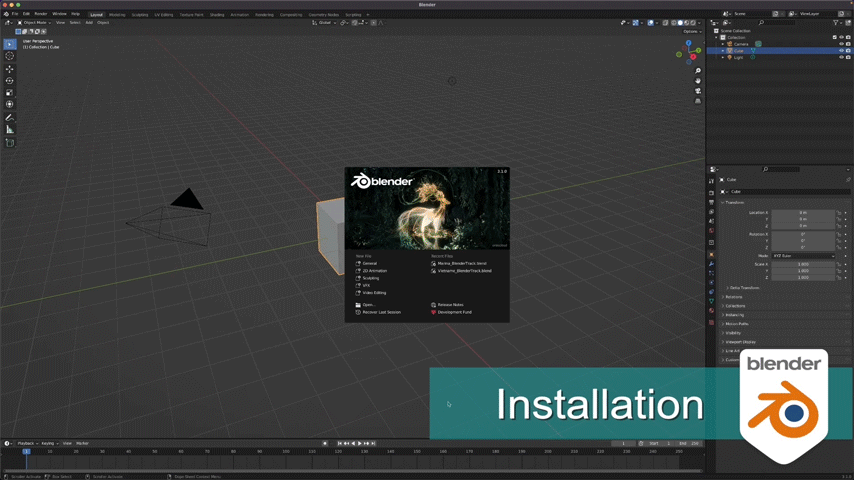

#############
Installation
#############
.. _installation:

|Video Link|

.. |Video Link| raw:: html

   <a href="https://youtu.be/XCLYPqfBJSM" target="_blank">Video Link</a>

----------------------------
After Effects Panel Install
----------------------------

#. Add **TrackerJack_AE.jsxbin** to your ScriptUI Panels folder (After Effects > Scripts > ScriptUI Panels)
#. Authenticate with your Admin password if necessary.
#. Open After Effects and select the **TrackerJack_AE.jsxbin** option in the Windows Menu command.
#. Drag the TrackerJack Panel to your desired location in the UI.

.. image:: images/Quick-Start-AE.gif
  :alt: TrackerJack_AE Installed
  
----------------------------
Blender Add-on Install
----------------------------
#. Open Blender and select to *Edit* -> *Preferences*.
#. Select the *Add-ons* tab on the left if it is not already.
#. Select the *Install...* button along the top.
#. This will open a file dialog. Navigate to where you have downloaded the **TrackerJack_importer.zip** file.  This file should not be unzipped.
#. Then, click the *Install add-on from file* button.
#. Search for the add-on by typing **TrackerJack_importer** in the search box if it does not already appear.
#. Make sure the checkbox next to the Add-on (**Import-Export: TrackerJack**) is checked:

If you have any issues please reach out for assistance at  `support@trackerjackapp.com <mailto:support@trackerjackapp.com>`_.

